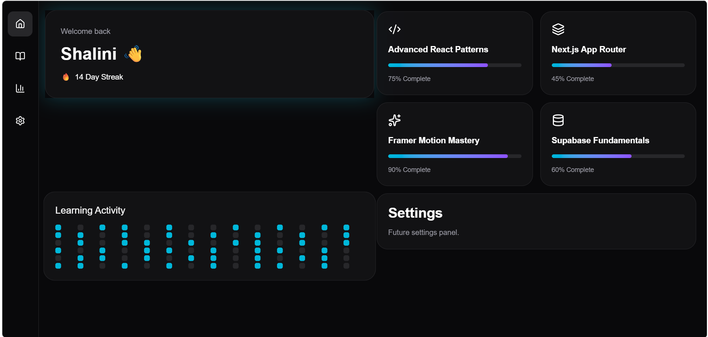
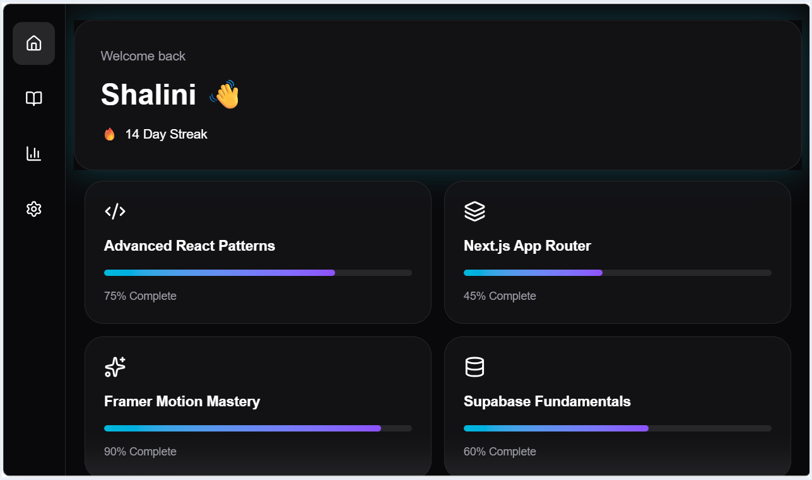
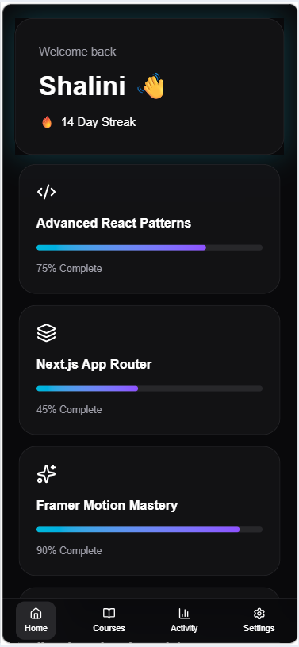

# 🚀 Next-Gen Learning Dashboard

A futuristic student dashboard built with **Next.js App Router**, **Supabase**, **Tailwind CSS**, and **Framer Motion**.

This project was created as part of a Frontend Intern Challenge focused on modern UI architecture, server-rendered data fetching, responsive design, and high-performance animations.

---

## 🔗 Live Demo

Vercel Deployment:

```txt
https://student-dashboard-khaki-ten.vercel.app/
```

---

## 📸 Application Preview

### Desktop



### Tablet



### Mobile



---

## 🛠 Tech Stack

### Frontend

- Next.js 15 (App Router)
- TypeScript
- Tailwind CSS
- Framer Motion
- Lucide React

### Backend

- Supabase PostgreSQL
- Supabase Server Client

### Deployment

- Vercel

---

## ✨ Features

### 🎨 Modern Bento Dashboard

- Dark futuristic UI
- Bento Grid layout
- Gradient/glow effects
- Responsive design

### 📚 Dynamic Course Management

Courses are fetched from Supabase.

Each course contains:

- Dynamic Icon
- Course Title
- Animated Progress Bar
- Completion Percentage

### ⚡ Framer Motion Animations

Implemented interactions include:

- Staggered tile loading
- Hover elevation effects
- Spring-based transitions
- Active navigation indicator
- Animated progress bars
- Mobile navigation interactions

### 📱 Fully Responsive

#### Desktop (>1024px)

- Sticky sidebar
- Multi-column Bento layout

#### Tablet (768px - 1024px)

- Compact sidebar
- Two-column grid

#### Mobile (<768px)

- Bottom navigation
- Single-column layout

---

## 🗄 Database Schema

### courses

| Column      | Type      |
|------------|-----------|
| id         | uuid      |
| title      | text      |
| progress   | integer   |
| icon_name  | text      |
| created_at | timestamp |

Example records:

```sql
INSERT INTO courses (title, progress, icon_name)
VALUES
('Advanced React Patterns', 75, 'Code2'),
('Database Fundamentals', 60, 'Database'),
('System Design Basics', 45, 'Layers'),
('AI Product Engineering', 90, 'Sparkles');
```

---

## 🏗 Architecture

### Server Components

The dashboard page uses a Next.js Server Component to fetch course data directly from Supabase.

Benefits:

- Faster initial render
- Reduced client-side JavaScript
- Secure database access
- Better performance

### Client Components

Interactive UI components are isolated into client components:

- Sidebar
- MobileNav
- HeroTile
- CourseCard
- ActivityTile
- SettingsTile
- ProgressBar

This separation keeps the application performant while still enabling rich animations.

---

## 🎬 Animation Strategy

To prevent layout shifts and ensure smooth interactions:

- Transform-based animations
- Opacity transitions
- Framer Motion spring physics
- Hardware-accelerated hover effects

Example configuration:

```ts
transition={{
  type: "spring",
  stiffness: 300,
  damping: 20,
}}
```

---

## 📂 Project Structure

```txt
src/
│
├── app/
│   ├── page.tsx
│   ├── loading.tsx
│   └── error.tsx
│
├── components/
│   ├── dashboard/
│   ├── layout/
│   ├── motion/
│   └── ui/
│
├── context/
│   └── DashboardContext.tsx
│
└── lib/
    └── supabase/
```

---

## ⚙ Environment Variables

Create:

```env
.env.local
```

Add:

```env
NEXT_PUBLIC_SUPABASE_URL=your_project_url
NEXT_PUBLIC_SUPABASE_ANON_KEY=your_anon_key
```

---

## 📦 Installation

Clone the repository:

```bash
git clone https://github.com/shalini02693/student-dashboard.git
```

Install dependencies:

```bash
npm install
```

Run development server:

```bash
npm run dev
```

Open:

```txt
http://localhost:3000
```

---

## 🚀 Deployment

The application is deployed using Vercel.

Steps:

1. Connect GitHub repository
2. Import project into Vercel
3. Add Supabase environment variables
4. Deploy

---

## 🧠 Challenges & Solutions

### Challenge 1

Maintaining smooth navigation between dashboard sections while keeping the sidebar and mobile navigation synchronized.

### Solution

Implemented a shared Dashboard Context to manage active navigation state across devices.

---

### Challenge 2

Creating interactive animations without causing layout shifts.

### Solution

Used Framer Motion transforms and spring-based transitions instead of modifying layout properties.

---

### Challenge 3

Keeping data fetching secure while maintaining a fast initial render.

### Solution

Used Next.js Server Components with Supabase server-side fetching.

---

## 👨‍💻 Author

Shalini Verma

Frontend Intern Challenge Submission